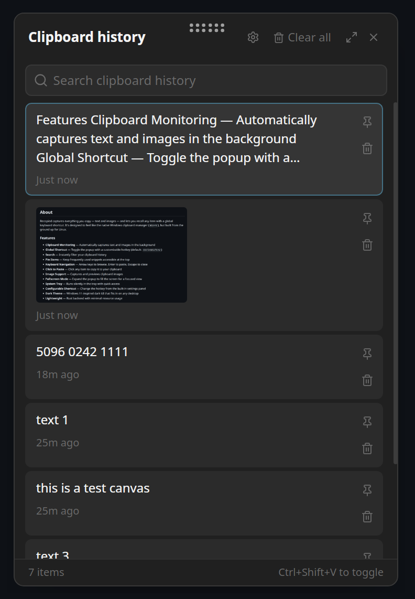

<div align="center">

# Recopied

**A lightweight clipboard history manager for Linux — inspired by Windows `Win+V`**



### Demo

<video src="https://github.com/mrbeandev/Recopied/raw/main/demo.mp4" width="600" controls></video>

[](LICENSE)
[](https://v2.tauri.app)
[](https://www.rust-lang.org)

</div>

---

## About

Recopied captures everything you copy — text and images — and lets you recall any item with a global keyboard shortcut. It's designed to feel like the native Windows clipboard manager (`Win+V`), but built from the ground up for Linux.

### Features

- **Clipboard Monitoring** — Automatically captures text and images in the background
- **Global Shortcut** — Toggle the popup with a customizable hotkey (default: `Ctrl+Shift+V`)
- **Search** — Instantly filter your clipboard history
- **Pin Items** — Keep frequently used snippets accessible at the top
- **Keyboard Navigation** — Arrow keys to browse, Enter to paste, Escape to close
- **Click to Paste** — Click any item to copy it to your clipboard
- **Image Support** — Captures and previews clipboard images
- **Fullscreen Mode** — Expand the popup to fill the screen for a focused view
- **System Tray** — Runs silently in the tray with quick access
- **Configurable Shortcut** — Change the hotkey from the built-in settings panel
- **Dark Theme** — Windows 11-inspired dark UI that fits in on any desktop
- **Lightweight** — Rust backend with minimal resource usage

## Tech Stack

| Layer | Technology |
|-------|-----------|
| Framework | [Tauri v2](https://v2.tauri.app) |
| Backend | Rust |
| Frontend | React + TypeScript |
| Styling | Tailwind CSS v4 |
| Icons | [Lucide](https://lucide.dev) |
| Database | SQLite (via `rusqlite`) |
| Clipboard | `xclip` (X11) / `arboard` (for writes) |

## Prerequisites

- **Rust** ≥ 1.77 — [Install](https://rustup.rs)
- **Node.js** ≥ 18 — [Install](https://nodejs.org)
- **Tauri v2 CLI** — `cargo install tauri-cli --version "^2"`
- **System dependencies** (Debian/Ubuntu/Mint):
  ```bash
  # X11
  sudo apt install libgtk-3-dev libwebkit2gtk-4.1-dev librsvg2-dev patchelf xclip
  # Wayland (additional)
  sudo apt install wl-clipboard
  ```

## Getting Started

```bash
# Clone the repository
git clone https://github.com/YOUR_USERNAME/recopied.git
cd recopied

# Install frontend dependencies
npm install

# Run in development mode
cargo tauri dev
```

## Building for Production

```bash
# Build optimized release binaries
cargo tauri build
```

This produces:
- `.deb` package — `src-tauri/target/release/bundle/deb/`
- `.AppImage` — `src-tauri/target/release/bundle/appimage/`

## Usage

| Action | How |
|--------|-----|
| Toggle popup | Press the configured shortcut (default: `Ctrl+Shift+V`) |
| Browse items | Arrow keys ↑↓ |
| Paste item | Click or press Enter |
| Search | Type in the search bar |
| Pin/Unpin | Hover → click pin icon, or right-click → Pin |
| Delete item | Hover → click trash icon, or right-click → Delete |
| Clear all | Click "Clear all" in the header |
| Fullscreen | Click the expand icon in the header |
| Change shortcut | Click the gear icon → Settings → Change shortcut |
| Close | Press Escape or click the X button |

## Configuration

Settings are stored at `~/.local/share/recopied/settings.json`:

```json
{
  "shortcut": "Ctrl+Shift+V"
}
```

Clipboard history is stored in a SQLite database at `~/.local/share/recopied/recopied.db`. Images are saved to `~/.local/share/recopied/images/`.

## Project Structure

```
recopied/
├── src/                          # React frontend
│   ├── components/               # UI components
│   │   ├── ClipboardPopup.tsx    # Main popup with search + item list
│   │   ├── ClipboardItemCard.tsx # Individual clipboard entry
│   │   ├── SearchBar.tsx         # Search input
│   │   ├── EmptyState.tsx        # Empty/no-results view
│   │   └── SettingsPanel.tsx     # Settings with shortcut recorder
│   ├── lib/tauri.ts              # Typed IPC wrappers
│   ├── types/clipboard.ts        # TypeScript interfaces
│   ├── App.tsx                   # Root component
│   └── index.css                 # Theme + animations
├── src-tauri/                    # Rust backend
│   ├── src/
│   │   ├── lib.rs                # App setup, tray, shortcut handler
│   │   ├── settings.rs           # Settings persistence
│   │   ├── clipboard/
│   │   │   ├── watcher.rs        # Background clipboard monitor
│   │   │   └── types.rs          # Data types
│   │   ├── commands/mod.rs       # IPC command handlers
│   │   └── db/
│   │       ├── mod.rs            # Database initialization
│   │       └── queries.rs        # CRUD operations
│   ├── Cargo.toml                # Rust dependencies
│   └── tauri.conf.json           # Tauri configuration
├── package.json
└── vite.config.ts
```

## Releasing

Recopied uses [Semantic Versioning](https://semver.org/) with versions synced across `package.json`, `src-tauri/Cargo.toml`, and `src-tauri/tauri.conf.json`.

### How to release a new version

```bash
# 1. Bump version in all config files
./scripts/bump-version.sh 1.1.0

# 2. Update CHANGELOG.md with the new version's changes

# 3. Commit and tag
git add -A
git commit -m "chore: bump version to 1.1.0"
git tag v1.1.0

# 4. Push (triggers GitHub Actions release build)
git push origin main --tags
```

The release workflow builds `.deb` and `.AppImage` packages for `x86_64` and `aarch64`, then creates a draft GitHub Release with the artifacts attached.

See [CHANGELOG.md](CHANGELOG.md) for the full version history.

## Contributing

Contributions are welcome! Please see [CONTRIBUTING.md](CONTRIBUTING.md) for guidelines.

## License

This project is licensed under the [MIT License](LICENSE).
